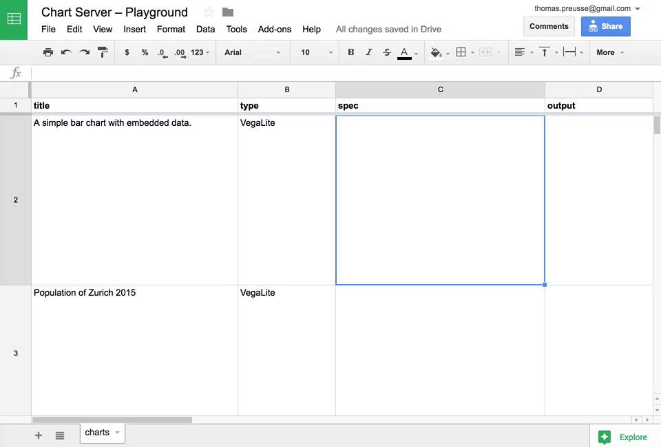

# Chart Server

A server for a light-weight charting system.

[](https://docs.google.com/spreadsheets/d/18ByaFrHDh7y0_nY-mFrk05Nx21e0UBAWe-qKfd2tAL8/edit#gid=0)

Read «[Roll your own charting system](https://blog.interactivethings.com/)» on the Interactive Things blog to learn more.

## Prerequisites

- make
- [Node.js](https://nodejs.org/) (v6)
- [Cairo](https://github.com/Automattic/node-canvas#installation)

## Develop

Install dependencies and start the development server

```
make
```

## Deploy

The repository contains a `Dockerfile` and `app.json` manifesto and can easily be deployed.

- [▲ ZEIT `now --docker`](https://zeit.co/now)
- [Deploy to Heroku](https://heroku.com/deploy)
